------------------------------------------------------------------------

``` r
library(KOH)
load("output.RData")
```

## Introduction

- Goal
- Calibration Model
- Implementation
- Toy Example
- Future Work/Improvement

## Calibration

$$
\begin{align}
&y_r  : \text{ Real Response} \\
&y_s: \text{Simulation Response} &\longrightarrow \ \ \ \ \ \eta (x_s, x_\kappa)\\
&y_f: \text{Field Response} &\longrightarrow \ \ \ \ \ \zeta (x_f|x_\kappa^*) \\
\end{align}
$$

$$
y_f  : y_r(.) + \epsilon \ \ \ \text{And} \ \ \ y_r\ = y_s(.) + b(.) \\
$$

$$\begin{align}
\implies  y_f  &= y_s(.) + b(.) + \epsilon \\
\implies y_f  &= \eta (x_b, x_\kappa^*) + \delta(x_b) + \epsilon \\
\text{And}\ \ \ \ \ y_s  &= \eta (x_s, x_\kappa) \\
\end{align}$$

$$
\implies  \begin{bmatrix} y_f^T \\ y_s^T\end{bmatrix} = \zeta(.,.) = \eta (., .) + \delta(.) + \epsilon \\
$$

## Assumptions

- $\eta(.,.) \sim GP \ [M_s(.,.), \ C_s\{(.,.),(.,.)\}]$
- $\delta(.) \ \ \sim GP \ [M_b(.), \ C_b(.,.)]$
- Assuming $M_s(.,.) = \mu_s (\text{scaler})$ and
  $M_b(.) = \mu_b (\text{scaler})$
- Where $C_s(.,.)$ and $C_b(.)$ are covariance structures

Therefore:

$$\zeta(.,.) \sim GP \ [\mu_y(.,.), \ \Sigma_y\{(.,.),(.,.)\}]$$

- $\mu_D : \begin{bmatrix} 1 & 0 \\ 1 & 1 \end{bmatrix}. \begin{bmatrix} \mu_s \\ \mu_b \end{bmatrix} = \begin{bmatrix} \mu_s \\ \mu_s + \mu_b \end{bmatrix}$
- $C_D: \begin{bmatrix} C_s(x_f,x_f) + C_b(x_b, x_b)+ \sigma^2_{\epsilon}.I_n & C_s(x_f, x_s) \\ C_s(x_s, x_f) & C_s(x_s, x_s) \end{bmatrix}$

## Correlation Family

$$
\begin{align}
&C(x_1, x_2) = \sigma^2 . R_(x_1, x_2) \\
&R = \prod^k_{i=1} e^{-\theta_i |x_{1,i} - x_{2,i}|^\alpha_i} = e^{-(\sum^k_{i=1} \theta_i |x_1 - x_2|^{\alpha_i})}
\end{align}
$$

- Power Exponential Family is chosen for flexibility
- Both GPs use same this correlation structure
- 3 sets of new hyperparameters for each GP
- $\psi_s = (\sigma^2_s, (\theta_{s,1}, ... , \theta_{s,p+q}), (\alpha_{s,1}, ... , \alpha_{s,p+q}))$
- $\psi_b = (\sigma^2_b, (\theta_{b,1}, ... , \theta_{b,p}), (\alpha_{b,1}, ... , \alpha_{b,p}))$

## Model Parameters

$$\Phi = (\mu, \kappa, \theta_s, \alpha_s, \theta_b, \alpha_b, \sigma^2_s, \sigma^2_b, \sigma^2_{\epsilon})$$

- Location Parameters: $\mu =$ ( $\mu_s, \mu_b$ )
- Calibration Parameters: $\kappa = (\kappa_1, ... , \kappa_q)$
- Simulation GP Scale: $\theta_s = (\theta_{s,1}, ... , \theta_{s,p+q})$
- Simulation GP Smoothness:
  $\alpha_s = (\alpha_{s,1}, ... , \alpha_{s,p+q})$
- Bias-Correction GP Scale:
  $\theta_b = (\theta_{b,1}, ... , \theta_{b,p})$
- Bias-Correction GP Smoothness:
  $\alpha_b = (\alpha_{b,1}, ... , \alpha_{b,p})$
- Simulation Marginal Variance: $\sigma^2_s$
- Bias-Correction Marginal Variance: $\sigma^2_b$
- Measurement Variance: $\sigma^2_{\epsilon}$

## Location Parameters

$$\mu_y = (\mu_s, \mu_b) = 0$$

- Simulation input is scaled to span $[0, 1]$

- Simulation output is standardized $[\text{mean} = 0, \text{sd} = 1]$

- Field input is scaled by same factor

- Field output is scaled by same factor

- Hence location parameter are considered $0$ vector

## Calibration Parameters

$$\kappa = (\kappa_1, ... , \kappa_q)$$

- Input in design matrix for simulation
- Set but often unknown in field experiments
- Strong priors: low variance Gaussian
- Vague priors: Beta $[1.1, 1.1]$
- Uninformative priors: Uniform over domain
- KOH recommends to include all parameters
- Engineering validation for defficult specification

## GP Scale Hyperparameters

- Restricted to positive values
- More concentration on small values (right-skewed)
- Gamma $[1.5, 0.1]$ is chosen for both GPs

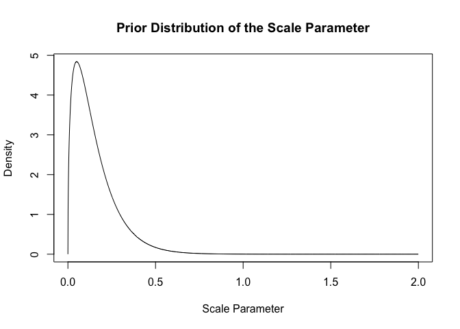

## GP Smoothness Hyperparameters

- Restricted to $(1, 2)$
- More concentration on larger values (left-skewed)
- Shifted Beta $[5, 2]$ is chosen for both GPs

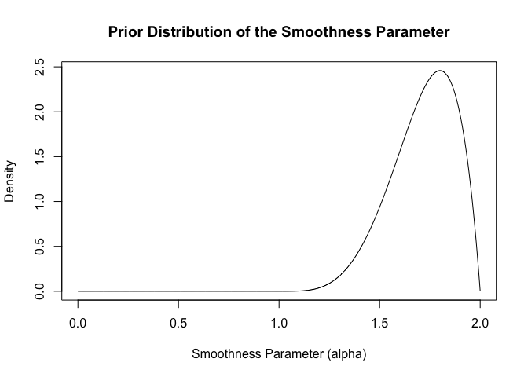

## Marginal Variance

- Restricted to positive values
- More concentrtion on smaller values (right-skewed)
- Inverse Gamma, Jefferey’s , and Gamma can be set

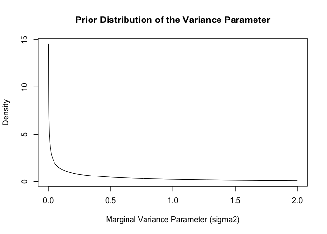

## Posterior Joint Distribution

$$
\begin{align}
&L(y | \Phi) =  \ |C_D|^{-\frac{1}{2}} \ . \ e^{- \frac{1}{2} y C_D^{-1}y^T}\\
&p[\Phi | y] \ \ \propto L(y | \Phi). p[\kappa].p[\theta].p[\alpha].p[\sigma^2] \\
\end{align}
$$

**Main computation:**

- Updating correlation matrices
- Computing Cholesky decomposition
- Computing posterior density

**Optimization: **

- Log transform converts products to sums
- Only changing parts are updated

## Computing Posterior Density

$$
\begin{align}
\log(L(y | \Phi)) &= -\frac{1}{2} \log(|C_D|) - \frac{1}{2} y C_D^{-1}y^T\\
\implies \ \ \log(p[\Phi | y])\  &\propto   \ \sum_{i=1}^qp[\kappa_i] + \sum_{i=1}^{p+q} p[\theta_{si}] + \sum_{i=1}^{p+q} p[\alpha_{si}] \\
& \ \ \ \ +  \sum_{i=1}^{p} p[\theta_{bi}] + \sum_{i=1}^{p} p[\alpha_{bi}] \\
& \ \ \ \ +\  p[\sigma_s^2] + p[\sigma_b^2]+ p[\sigma_{\epsilon}^2] \\
& \ \ \ \ -\frac{1}{2} \log(|C_D|) - \frac{1}{2} y C_D^{-1}y^T
\end{align}
$$

## Bayesian Inference

**Calibration Parameters $\kappa$**

- $p[\kappa | y]$ is obtained from $p[\Phi | y]$ draws
- Provides data-based update to the $\kappa$ prior
- Point Prediction: *Expectation or Mode of sample distribution*
- $100 \times (1-\alpha) \%$ Credible Set: *Upper $\&$ lower $\alpha/2$
  quantiles*
- Alternatively, highest posterior density set can be formed (not
  implemented)
- Results must be scaled back to original range

**Mean Response of Physical System $\mu_D(x)$**

$$
\begin{align}
Y(x) \ &= M(x) + \epsilon \\
M(x) &= Y_s(x, \kappa) + \Delta(x) 
\end{align}
$$

Using $[\Phi|D]$ we can form an estimate for $\mu(x)$:

$$
\begin{align}
\hat{\mu(x)} &= E[M(x)|D] = E[E[M(x)|D, \Phi]] \\ \\
&= \int E[M(x)|D, \Phi] [\Phi|D] d\Phi \\
& \approx \frac{1}{N_{mcmc}} \sum_{i=1}^{N_{mcmc}} E[M(x)|D, \Phi^{(i)}]
\end{align}
$$

**Mean Response of Physical System $\mu_D(x)$** \\

- Where $\Phi^{(i)}$ represents the parameters in i-th iteration of MCMC

- $[M(x) \ | \ D, \Phi]$ has a univariate normal distribution

- **Mean:** $E[M(x) \ | \ D, \Phi] = C_{x,D}^T C_D^{-1} y$

- **Variance:**
  $C_{x,D} = \sigma^2_s \begin{bmatrix} R_s(x^*, x_f) \\ R_s(x^*, x_s) \end{bmatrix} + \sigma^2_b \begin{bmatrix} R_b(x, x_b) \\ 0 \end{bmatrix}$

- $x$: a vector of new data with only experimental input

- $x^*$: a vector of new data augmented with calibration input

**Bias-Correction $\delta(x)$**

Using $[\Delta|D]$ we can form an estimate for $\delta(x)$:

$$
\begin{align}
\hat{\delta(x)} &= E[\Delta(x)|D] = E[E[\Delta(x)|D, \Phi]] \\ \\
&= \int E[\Delta(x)|D, \Phi] [\Phi|D] d\Phi \\
& \approx \frac{1}{N_{mcmc}} \sum_{i=1}^{N_{mcmc}} E[\Delta(x)|D, \Phi^{(i)}]
\end{align}
$$ - Where
$E[\Delta(x)|D, \Phi^{(i)}]= \sigma^2_b . R_b^T(x,x_b) C_D^{-1} y$

**Calibrated Simulator**

$$E[Y_s(x, \kappa)| D] = E[E[Y_s(x, \kappa)| D, \Phi]]$$

- Predictor of the simulator response at true $\kappa$

To form estimate:

- Replace $\kappa$ by its estimate

- Unknown $y_s^*$ is predicted using other parameters

- Compute a MCMC-based estimate, similar to Mean and Bias

- Uncertainty quantification for all prediction can be done using sample
  draws

# Implementation

## `calibrate()`

**Input**

- Data: Simulation and Field Data
- Priors: Prior Distribution Specification
- MCMC: Number of Iterations, Burn-In, Thinning Rate
- Initial Values

**Output**

- Parameter Draws
- Acceptance Rates
- Cache Environment

## `calibrate()`

**Procedure**

1.  Update the default values (`control()`)
2.  Build prior functions (`setup_priors()`)
3.  Set up initial values as seed for first iteration
4.  Create a global cache environment (`setup_cache()`)
5.  Run MCMC algorithm to draw samples (`mcmc()`)
6.  Prepare `fbc` object after last iteration (`output()`)

## `setup_priors()`

**Input:** Prior Specification Arguments

**Output:** A function that computes the **log** requested prior density

**Procedure:**

- Using type string switch to appropriate function definition
- 12 common prior density function wrappers are implemented
- Return prior density function definition

## `setup_cache()`

**Input:** Field and Simulation Data, Prior Functions, Initial values

**Output:** A list of initial values vector and and log posterior

**Procedure:**

- Scale/shift $X_s$ to span $[0, 1]$

- Scale/center $y_s$ for $\text{mean } = 0$ and $\text{sd} = 1$

- Scale/shift $X_b$ using simulation scale/shift

- Scale/center $y_f$ using simulation scale.center

- Initialize first row of parameters $\Phi$

- …

## `setup_cache()`

**Procedure (continue):**

- Create Correlation Matrices

- Form Augmented Covariance Matrix $C_D$

$C_D = \sigma^2_s \begin{bmatrix} R_{ff}^s & R_{fs}^s \\ R_{sf}^s & R_{ss}^s \end{bmatrix} + \sigma^2_b \begin{bmatrix} R_{bb}^b & 0 \\ 0 & 0 \end{bmatrix} + \sigma^2_{\epsilon} \begin{bmatrix} I_n & 0 \\ 0 & 0 \end{bmatrix}$

- Compute Cholesky Decomposition of $C_D$

- Compute Inverse and Determinant of $C_D$

- Compute Log Posterior Density

- Load Updating Variables to `cache`

## `mcmc()`

**Input:** Prior Functions and MCMCM Parameters

**Output:** NO Output

**Procedure (Metropolis-Within-Gibbs):**

Iterate Over $i \text{ in } 2:N_{mcmc} :$

Iterate Over Number of Parameters ($j \text{ in 1:k}$) :

For each iteration: - Compute Metropolis Update MU (`proposal()`) -
Create the Updated Parameter vector

$$\phi = c(\Phi[i, 1:j-1] ,\ MU, \ \Phi[i-1, j+1:k]) $$

- Update Covariance Matrix (`update_cov()`)
- …

## `mcmc()`

**Procedure (Metropolis-Within-Gibbs Continue):**

- Compute Log Posterior
- Compute Difference Between Consequtive Log Posteriors
- Draw a Sample from
- If difference \> log $Unif(0, 1)$
  - Accept the change and update parameters/ log posterior
- Otherwise, reject the change and replace it with last value
- Update acceptance rate every $50$ iterations

## `proposal()`

**Input:** runs so far and last MU, proposal sd, acceptance rate

**Output:** proposed MU, updated proposal sd

**Procedure (Adaptive Proposal):**

- Switch to appropriate parameter proposal
- Transform parameter to span $(-\infty, \infty)$
- Compute new proposal sd using last acceptance rate
  - If $rate > 0.44$ reduce sd, otherwise increase sd
  - sd change $\text{init} / \sqrt(\text{runs)}$ diminishes
- Propose a new sample using symmetric Gaussian proposal
- Transform back parameter to its original scale and return it

## `update_cov()`

**Input:** Vector of parameters and index of changed parameter

**Output:** Inverse and determinant of augmented covariance matrix

**Procedure:**

- Branch out to minimal changes based on index

- Update correlation matrices

- Reform augmented covariance matrix

- Compute its Cholesky decomposition

- Compute and return its inverse and determinant

## `correlation()`

**Input:** 2 matrices and Correlation hyperparameters

**Output:** Correlation matrix

**Procedure:**

- Determine whether input has 1 or 2 matrices

- Branch out to compute correlation

- Optimized to use symmetric property of self-correlation

- Tested for correctness

## `output()`

**Input:** No input (uses cache)

**Output:** parameter samples, acceptance, priors, log posterior, and
cache

**Procedure:**

- Name parameters for output

- Scale back calibration parameters

- Compute mean, sd, mode, credible set

- Create a S3 object of class `fbc` and return it

## `predict.fcb()`

**Input:** Prior Specification Arguments

**Output:** A function that computes the **log** requested prior density

**Procedure:**

## Toy Example

- Experimental Input: height ($h$) of a wiffle ball before drop
- Calibration Input: gravity ($g$) mixed with other factors
- Response: time ($t$) for the ball to hit the ground
- Field Observation (credit: Bingham, Leoppky)
- Simple Simulation Model

$$t = \sqrt{\frac{2h}{g}}$$

## Data

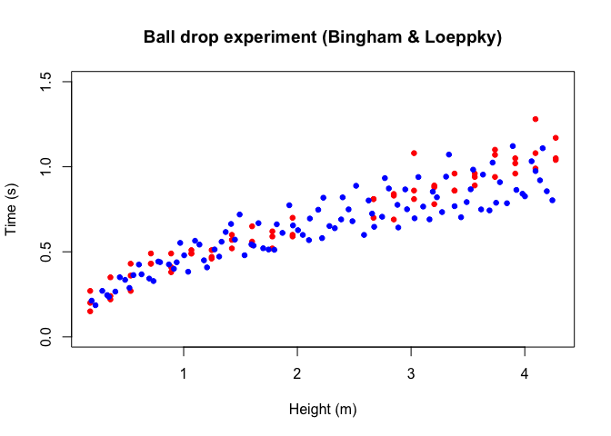<!-- -->

## Results

- Sample Markov Chains
- Estimated Posterior Densities \_ Point Estimates and Credible Sets
- Effects of Initial Values
- Effects of Calibration Prior
- Effects of Error Priors

## Markov Chains

**Calibration Parameter (Gravity)**

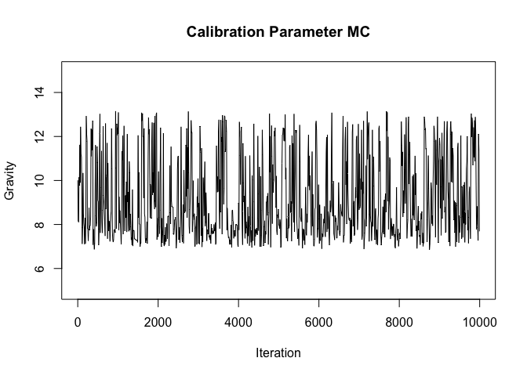<!-- -->

## Markov Chains

**Simulation Correlation Hyperparameters**

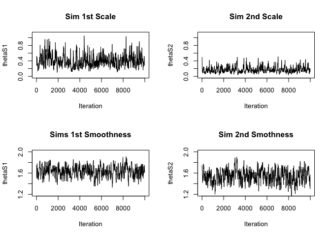<!-- -->

## Markov Chains

**Bias-Correction Correlation Hyperparameters**

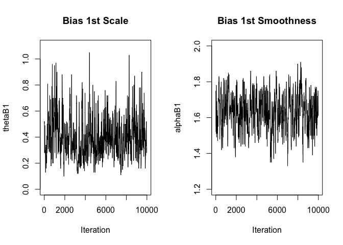<!-- -->

## Markov Chains

**Variance (Precision) Parameters**

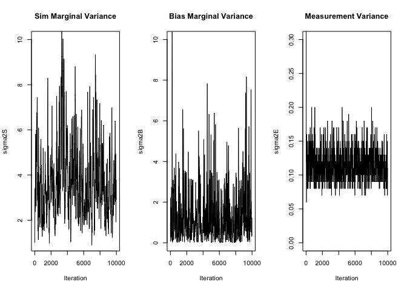<!-- -->

## Estimated Posterior Densities

**Posterior Density for Calibration Parameter**

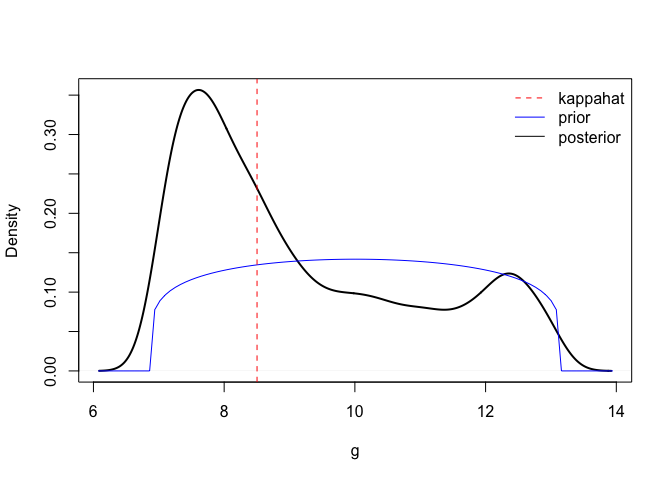<!-- -->

## Estimated Posterior Densities

**Posterior Density for Simulation GP Hyperparameters**

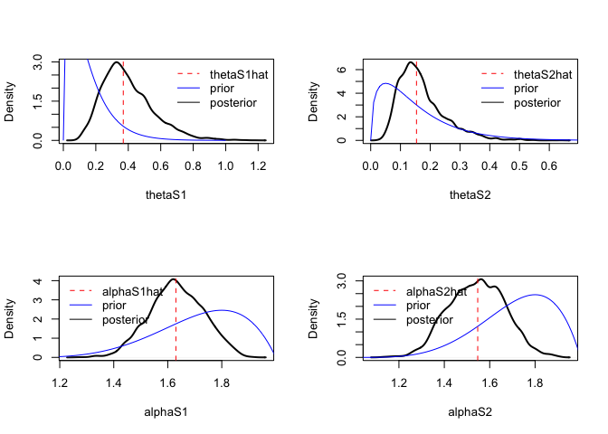<!-- -->

## Estimated Posterior Densities

**Posterior Density for Bias-Correction GP Hyperparameters**

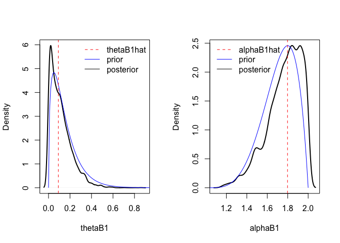<!-- -->

## Estimated Posterior Densities

**Posterior Density for Variance Parameters**

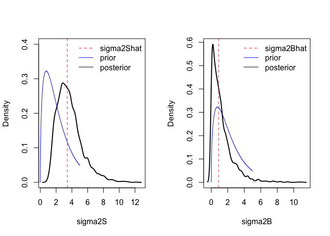<!-- -->

## Estimated Posterior Densities

**Posterior Density for Measurement Variance**

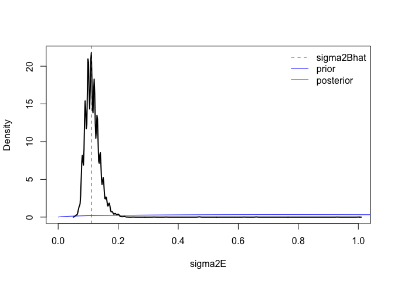<!-- -->

## Parameter Estimates

<table>
<thead>
<tr>
<th style="text-align:left;">
</th>
<th style="text-align:right;">
Sample MEan
</th>
<th style="text-align:right;">
Sample SD
</th>
<th style="text-align:right;">
5% Quantile
</th>
<th style="text-align:right;">
95% Quantile
</th>
<th style="text-align:right;">
Mode
</th>
</tr>
</thead>
<tbody>
<tr>
<td style="text-align:left;">
kappa1
</td>
<td style="text-align:right;">
9.15
</td>
<td style="text-align:right;">
1.80
</td>
<td style="text-align:right;">
7.27
</td>
<td style="text-align:right;">
12.22
</td>
<td style="text-align:right;">
8.50
</td>
</tr>
<tr>
<td style="text-align:left;">
thetaS1
</td>
<td style="text-align:right;">
0.40
</td>
<td style="text-align:right;">
0.16
</td>
<td style="text-align:right;">
0.22
</td>
<td style="text-align:right;">
0.61
</td>
<td style="text-align:right;">
0.37
</td>
</tr>
<tr>
<td style="text-align:left;">
thetaS2
</td>
<td style="text-align:right;">
0.17
</td>
<td style="text-align:right;">
0.08
</td>
<td style="text-align:right;">
0.09
</td>
<td style="text-align:right;">
0.28
</td>
<td style="text-align:right;">
0.15
</td>
</tr>
<tr>
<td style="text-align:left;">
alphaS1
</td>
<td style="text-align:right;">
1.63
</td>
<td style="text-align:right;">
0.10
</td>
<td style="text-align:right;">
1.50
</td>
<td style="text-align:right;">
1.76
</td>
<td style="text-align:right;">
1.63
</td>
</tr>
<tr>
<td style="text-align:left;">
alphaS2
</td>
<td style="text-align:right;">
1.54
</td>
<td style="text-align:right;">
0.12
</td>
<td style="text-align:right;">
1.38
</td>
<td style="text-align:right;">
1.70
</td>
<td style="text-align:right;">
1.55
</td>
</tr>
<tr>
<td style="text-align:left;">
thetaB1
</td>
<td style="text-align:right;">
0.11
</td>
<td style="text-align:right;">
0.10
</td>
<td style="text-align:right;">
0.01
</td>
<td style="text-align:right;">
0.25
</td>
<td style="text-align:right;">
0.09
</td>
</tr>
<tr>
<td style="text-align:left;">
alphaB1
</td>
<td style="text-align:right;">
1.77
</td>
<td style="text-align:right;">
0.17
</td>
<td style="text-align:right;">
1.52
</td>
<td style="text-align:right;">
1.96
</td>
<td style="text-align:right;">
1.80
</td>
</tr>
<tr>
<td style="text-align:left;">
sigma2S
</td>
<td style="text-align:right;">
3.69
</td>
<td style="text-align:right;">
1.59
</td>
<td style="text-align:right;">
1.89
</td>
<td style="text-align:right;">
5.88
</td>
<td style="text-align:right;">
3.42
</td>
</tr>
<tr>
<td style="text-align:left;">
sigma2B
</td>
<td style="text-align:right;">
1.27
</td>
<td style="text-align:right;">
1.32
</td>
<td style="text-align:right;">
0.10
</td>
<td style="text-align:right;">
2.94
</td>
<td style="text-align:right;">
0.89
</td>
</tr>
<tr>
<td style="text-align:left;">
sigma2E
</td>
<td style="text-align:right;">
0.11
</td>
<td style="text-align:right;">
0.03
</td>
<td style="text-align:right;">
0.09
</td>
<td style="text-align:right;">
0.14
</td>
<td style="text-align:right;">
0.11
</td>
</tr>
</tbody>
</table>

## Point Prediction of Physical Mean Response

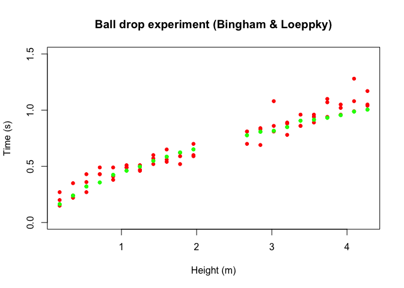<!-- -->

## Effects of Initial values

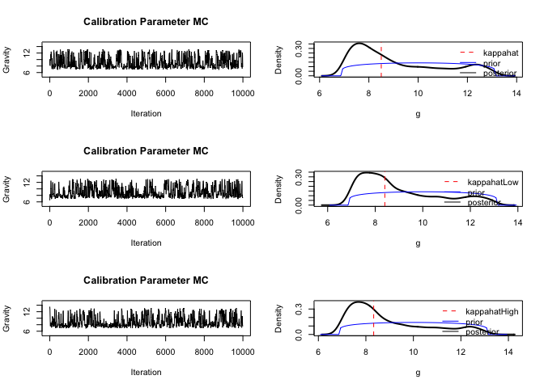<!-- -->

## Future Work/Improvement

- Adding Functional Mean to Model as an Option
- Employ Parallel Computing for Parallel Chains
- Implement a Rosenthal Adaptive Proposal
- Implement Extended Predict Function
- Investigate Effect of the Priors Systematically
- Evaluate Out of Sample Performance
